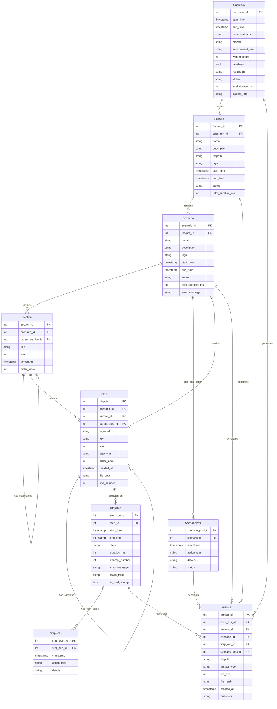

# Cucu Run Database Requirements Spec

## Overview

Cucu needs to create and maintain a structured database to store all relevant test execution data from `cucu run` commands. This database will provide a comprehensive, queryable record of test results to enable better analysis, reporting, and debugging. The database will serve as a centralized repository for historical test data that can be used for trend analysis, test effectiveness reporting, and failure pattern detection.

## Prerequisites

This specification depends on the implementation of the enhanced section steps functionality described in the [Section Steps Implementation Specification](/Users/cedric.young/code/cucu/specs/section_steps_specs.md), which provides the hierarchical structure used by the database schema.

## Core Requirements

- **CLI Configuration**:
  - Add `--database/--no-database` flag to enable/disable database functionality (disabled by default)

- **Implementation Approach**:
  - Keep existing output artifacts (PNG files, directory structures, JSON, logs, etc.)
  - Create a single DuckDB database file at the start of a test run (if it doesn't exist)
  - The database is shared between all workers in a multi-worker run
  - Update the database in real-time at defined points in the test execution lifecycle
  - Ensure proper transaction management to prevent race conditions or deadlocks
  - Maintain database validity even if the cucu process or a worker is killed unexpectedly
  - Store file metadata in the database instead of the actual file contents
  - Register database operations in appropriate lifecycle hooks (before/after scenario, feature, etc.)
  - Use a connection pool mechanism to handle parallel worker access efficiently
  - Implement timeout mechanisms for database operations to prevent hanging

- **Performance Considerations**:
  - Minimize overhead of database operations during test execution
  - Implement database operations asynchronously where possible
  - Add periodic compaction/cleanup mechanism for long-term database health
  - Monitor and optimize query performance for large test suites
  - Batch database operations where appropriate to reduce transaction overhead
  - Implement indexes on frequently queried columns for performance
  - Consider implementing a worker-local cache for repeated queries
  - Add monitoring and logging of database operation performance

## Database Schema

The database schema is designed to follow the natural hierarchy of BDD testing, with tables linked through foreign keys to create a complete representation of test execution.

### Tables Structure

All tables have the following conventions:
- Primary key column named `{tablename}_id`
- Timestamps for creation and last update
- Status fields where appropriate (passed, failed, skipped, etc.)
- Descriptive fields for key metadata
- Foreign keys to establish relationships between tables
- Unique constraints where appropriate to prevent duplicate entries

### Tables Definition

1. **CucuRun**: Master record for each test execution
   - One record per `cucu run` command, even with multiple workers
   - Contains all command-line arguments, environment variables, and system information
   - Serves as the parent record for all other tables

2. **Feature**: Maps to a feature file
   - One record per feature file included in the run
   - Contains feature metadata (description, filename, tags, etc.)
   - Features don't execute directly, but contain scenarios that do

3. **Scenario**: Maps to a scenario within a feature file
   - Contains scenario metadata (name, description, tags, etc.)
   - Inherits and includes tags from parent feature
   - Records execution statistics (duration, status, etc.)

4. **Section**: Maps to section steps that organize test steps
   - Represents hierarchical organization within scenarios
   - Contains section level information (heading level, description)
   - Can have sub-sections with links to parent sections
   - Acts as logical grouping for steps that follow
   - If no sections are in a scenario then all steps are contained in the scenario
   - Supports up to 4 levels of nesting (#, ##, ###, ####)

5. **Step**: Maps to individual test steps
   - Contains step definition (text, step type, filename and line number, etc.)
   - Records hierarchy information (parent step, step-level, etc.)
   - Links to parent sections for organizational structure
   - Excludes section steps, which are recorded in the Section table
   - Supports substeps for complex step implementations

6. **StepRun**: Records each execution attempt of a step
   - Steps can be retried, so each attempt is a separate record
   - Contains execution details (status, duration, error messages, etc.)
   - Links to associated screenshots and other artifacts in the artifacts table
   - Records detailed performance metrics for step execution

7. **StepPost**: Records post-step activities
   - Specifically captures screenshot actions after step execution
   - Contains metadata about artifacts generated after steps
   - Links to the original step run
   - Records any cleanup or verification actions

8. **ScenarioPost**: Records the post-scenario activities
   - Activities of all the after scenario hooks (which don't change scenario status and not displayed in html report)
   - Captures cleanup actions and verification steps
   - Contains references to any artifacts generated during post-scenario activities

9.  **Artifact**: Records file-based outputs
   - Stores metadata about generated files (screenshots, logs, downloaded files, etc.)
   - Contains file path, name, file suffix, size, hash, timestamp, and other metadata
   - Links to associated test elements (steps, scenarios, etc.)
   - Supports classification and categorization of different artifact types

## Database Diagram


```

## Integration Points

The database functionality should integrate with the existing cucu codebase at the following points:

1. **CLI Module** (`src/cucu/cli/core.py`):
   - Add database-related command-line arguments
   - Initialize database connection based on arguments

2. **Environment Hooks** (`src/cucu/environment.py`):
   - `before_all`: Initialize database and create CucuRun record
   - `after_all`: Finalize CucuRun record with execution statistics
   - `before_feature`: Create Feature record
   - `after_feature`: Update Feature record with results
   - `before_scenario`: Create Scenario record
   - `after_scenario`: Update Scenario record with results
   - `before_step`: Record Step data (implicitly via step execution)
   - `after_step`: Record StepRun and StepPost data

3. **Section Steps** (`src/cucu/steps/comment_steps.py` → `src/cucu/steps/section_steps.py`):
   - Rename file and update implementation
   - Add support for hierarchical heading levels
   - Integrate with database to record section structure

4. **Screenshot Functionality** (`src/cucu/utils.py`):
   - Enhance `take_screenshot()` function to record screenshot metadata in the database
   - Add database operations to link screenshots with StepRun records
   - Store artifact metadata when screenshots are taken
   - Integrate with the StepPost table to track post-step screenshot activities

## Database Query Interface

A new `cucu db` command will be added to provide a command-line interface for querying the database:

```bash
cucu db [SUBCOMMAND] [OPTIONS]
```

Subcommands will include:

1. **query**: Execute a SQL query against the database
   ```bash
   cucu db query --db results/results.db "SELECT * FROM CucuRun"
   ```

2. **stats**: Generate ad-hoc statistics for a specific run or sets of runs
   ```bash
   cucu db stats --db results/results.db --run-id 123
   ```

3. **list**: List available runs, features, scenarios, etc.
   ```bash
   cucu db list --db results/results.db runs
   cucu db list --db results/results.db features --run-id 123
   ```

4. **export**: Export database contents to various formats (CSV, JSON, etc.)
   ```bash
   cucu db export --db results/results.db --format csv --output results.csv
   ```

5. **compact**: Perform database maintenance and compaction
   ```bash
   cucu db compact --db results/results.db
   ```

The query interface will provide a powerful way to analyze test results, generate reports, and perform database maintenance operations.

## Section Steps Database Integration

When the database functionality is enabled, section steps will:

1. Be stored in the `Section` table, not the `Step` table
2. Record their hierarchical relationship (parent-child links)
3. Store their heading level (1-4)
4. Maintain the order of appearance in the scenario
5. Group regular steps that belong to each section

This structure enables efficient querying of test execution data organized by sections and subsections, providing a logical view of the test execution flow.

## Implementation Plan

1. **Database Setup**:
   - Add database initialization to `before_all` hook
   - Create schema creation functions
   - Implement connection pooling for worker access
   - Add error handling for database operations
   - Add database connection timeout and retry mechanisms

2. **Record Creation**:
   - Implement functions to create/update records for each table
   - Add transaction management to prevent concurrency issues
   - Ensure proper error handling for database operations
   - Implement optimistic locking for concurrent worker updates
   - Add batch operations for performance optimization

3. **Section Steps Enhancement**:
   - Rename and update the section steps implementation
   - Add support for different heading levels
   - Modify HTML output to reflect heading hierarchy
   - Update tests to validate the new section step functionality
   - Add documentation for the new section step feature

4. **Query Interface**:
   - Implement helper functions to query database for test results
   - Add utility for exporting database contents to other formats
   - Develop basic analytics and reporting functions
   - Create command-line interface for database queries
   - Add visualization capabilities for test results analysis

5. **Testing Strategy**:
   - Develop unit tests for database operations
   - Create integration tests for database functionality
   - Benchmark performance impact of database operations during test runs
   - Test with multi-worker parallel execution to validate concurrency handling
   - Test recovery from unexpected termination scenarios
