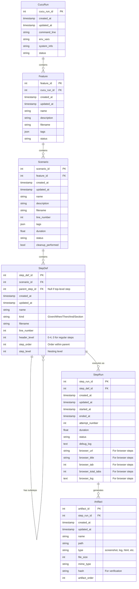

# Cucu Run Database Requirements Spec <!-- omit from toc -->

## Overview

Cucu needs to create and maintain a structured database to store all relevant test execution data from `cucu run` commands. This database will provide a comprehensive, queryable record of test results to enable better analysis, reporting, and debugging. The database will serve as a centralized repository for historical test data that can be used for trend analysis, test effectiveness reporting, and failure pattern detection.

## TOC <!-- omit from toc -->
- [Overview](#overview) <!-- omit from toc -->
- [Prerequisites](#prerequisites)
- [Core Requirements](#core-requirements)
- [Database Schema](#database-schema)
  - [Tables Structure](#tables-structure)
  - [Tables Definition](#tables-definition)
- [Detailed Schema Definition](#detailed-schema-definition)
  - [CucuRun Table](#cucurun-table)
  - [Feature Table](#feature-table)
  - [Scenario Table](#scenario-table)
  - [StepDef Table](#stepdef-table)
  - [StepRun Table](#steprun-table)
  - [Artifact Table](#artifact-table)
  - [Entity-Relationship Diagram](#entity-relationship-diagram)
- [Integration with Lifecycle Hooks](#integration-with-lifecycle-hooks)
- [Failure Recovery](#failure-recovery)
- [Example Queries](#example-queries)
- [Database Migration Strategy](#database-migration-strategy)
- [Database Size Management](#database-size-management)
- [User Interface Considerations](#user-interface-considerations)

## Prerequisites

This specification depends on the implementation of the enhanced section steps functionality described in the [Section Steps Implementation Specification](/Users/cedric.young/code/cucu/specs/section_steps_specs.md), which provides the hierarchical structure used by the database schema.

## Core Requirements

- **CLI Configuration**:
  - Add `--database/--no-database` flag to enable/disable database functionality (disabled by default)
  - Add `--db-path` option to specify the database file location (default: `./cucu_results.duckdb`)
 
- **Implementation Approach**:
  - Keep existing output artifacts (PNG files, directory structures, JSON, logs, etc.)
  - Create a single DuckDB database file at the start of a test run (if it doesn't exist)
  - The database is shared between all workers in a multi-worker run
  - Update the database in real-time at defined points in the test execution lifecycle
  - Ensure proper transaction management to prevent race conditions or deadlocks
  - Maintain database validity even if the cucu process or a worker is killed unexpectedly
  - Store file metadata in the database instead of the actual file contents
  - Register database operations in appropriate lifecycle hooks (before/after scenario, feature, etc.)
  - Use a connection pool mechanism to handle parallel worker access efficiently
  - Implement timeout mechanisms for database operations to prevent hanging

- **Performance Considerations**:
  - Minimize overhead of database operations during test execution
  - Implement database operations asynchronously where possible
  - Add periodic compaction/cleanup mechanism for long-term database health
  - Monitor and optimize query performance for large test suites
  - Batch database operations where appropriate to reduce transaction overhead
  - Implement indexes on frequently queried columns for performance
  - Consider implementing a worker-local cache for repeated queries
  - Add monitoring and logging of database operation performance

### Out of scope

The following are not supported:
1. Database Migration
2. Database Size Management
3. Data Export

## Database Schema

The database schema is designed to follow the natural hierarchy of BDD testing, with tables linked through foreign keys to create a complete representation of test execution.

### Tables Structure

All tables have the following conventions:
- Primary key column named `{tablename}_id`
- Timestamps for creation and last update
- Status fields where appropriate (passed, failed, skipped, etc.)
- Descriptive fields for key metadata
- Foreign keys to establish relationships between tables
- Unique constraints where appropriate to prevent duplicate entries

### Tables Definition

1. **CucuRun**: Master record for each test execution
   - One record per `cucu run` command, even with multiple workers
   - Contains all command-line arguments, environment variables, and system information
   - Serves as the parent record for all other tables

2. **Feature**: Maps to a feature file
   - One record per feature file included in the run
   - Contains feature metadata (name, description, filename, tags)
   - Features don't execute directly, but contain scenarios that do
   - Foreign key to CucuRun

3. **Scenario**: Maps to a scenario within a feature file
   - Contains scenario metadata (name, description, tags, filename and linenumber)
   - Inherits tags from parent feature
   - Records execution statistics (duration, status, etc.)
   - Records cleanup activity
   - Foreign key to Feature

4. **StepDef**: Maps to either a step in a feature file or to a step used in run_steps
   - Contains step definition (name, kind (Given/When/Then/And/Section)
   - Metadata (filename and line number)
   - Header level (normally 0)
   - Step order number (starts from 1)
   - Records hierarchy information (parent step def, step level)
   - Foreign key to Scenario
   - Self-referencing foreign key to parent StepDef (null if top-level step)
   1. **Section**:
      - Sets the header level 1-4 (using markdown headers #, ##, ###, ####)
      - Represented as StepDef rows with kind="Section" and appropriate header_level
   2. **SubStep**: Steps that have a parent step
      - Has a parent step (could be another step or a section step)
      - Represented as StepDef rows with non-null parent_step_id

5. **StepRun**: Records each execution attempt of a step
   - Steps can be retried, so each attempt is a separate record
   - try attempt number (starting at 1 per StepDef)
   - Contains metadata (status, start, end, duration)
   - Has cucu debug log
   - Browser metadata for browser steps (browser log, broswer url, title, tab number, total tabs)
   - Links to associated screenshots and other artifacts in the artifacts table
   - Foreign key to StepDef

6.  **Artifact**: Records file-based outputs
   - Stores metadata about generated files
   - Contains file data (name, path, stats)
   - For screenshots and other output files (HTML reports, logs, etc.)
   - Links to associated test elements (steps, scenarios, etc.)
   - Artifact order number (starts from 1, order per StepRun)
   - Supports classification and categorization of different artifact types
   - Foreign key to StepRun

## Detailed Schema Definition

Below is the detailed schema for each table, including column names, data types, and constraints:
- ID's are only used within the particular results db file

### CucuRun Table

| Column         | Type      | Constraints | Description                                           |
| -------------- | --------- | ----------- | ----------------------------------------------------- |
| cucu_run_id    | INTEGER   | PRIMARY KEY | Unique identifier for the run                         |
| created_at     | TIMESTAMP | NOT NULL    | When the run record was created                       |
| updated_at     | TIMESTAMP | NOT NULL    | When the run record was last updated                  |
| command_line   | TEXT      | NOT NULL    | Full command line used to start the run               |
| env_vars       | JSON      | NOT NULL    | Environment variables at run time                     |
| system_info    | JSON      | NOT NULL    | System information (OS, Python version, etc.)         |
| status         | TEXT      | NOT NULL    | Overall run status (running, completed, failed, etc.) |
| worker_count   | INTEGER   | NOT NULL    | Number of workers used in the run                     |
| start_time     | TIMESTAMP | NOT NULL    | When the run started                                  |
| end_time       | TIMESTAMP |             | When the run ended (null if still running)            |
| total_duration | FLOAT     |             | Total execution time in seconds                       |

### Feature Table

| Column      | Type      | Constraints | Description                                                 |
| ----------- | --------- | ----------- | ----------------------------------------------------------- |
| feature_id  | INTEGER   | PRIMARY KEY | Unique identifier for the feature                           |
| cucu_run_id | INTEGER   | FOREIGN KEY | Reference to the parent run                                 |
| created_at  | TIMESTAMP | NOT NULL    | When the record was created                                 |
| updated_at  | TIMESTAMP | NOT NULL    | When the record was last updated                            |
| name        | TEXT      | NOT NULL    | Name of the feature                                         |
| description | TEXT      |             | Description of the feature                                  |
| filename    | TEXT      | NOT NULL    | Path to the feature file                                    |
| tags        | JSON      |             | Tags associated with the feature                            |
| status      | TEXT      | NOT NULL    | Feature status (not started, running, passed, failed, etc.) |
| start_time  | TIMESTAMP |             | When feature execution started                              |
| end_time    | TIMESTAMP |             | When feature execution ended                                |

### Scenario Table

| Column            | Type      | Constraints | Description                                                  |
| ----------------- | --------- | ----------- | ------------------------------------------------------------ |
| scenario_id       | INTEGER   | PRIMARY KEY | Unique identifier for the scenario                           |
| feature_id        | INTEGER   | FOREIGN KEY | Reference to the parent feature                              |
| db_created_at        | TIMESTAMP | NOT NULL    | When the record was created                                  |
| db_updated_at        | TIMESTAMP | NOT NULL    | When the record was last updated                             |
| name              | TEXT      | NOT NULL    | Name of the scenario                                         |
| description       | TEXT      |             | Description of the scenario                                  |
| filename          | TEXT      | NOT NULL    | Path to the feature file                                     |
| line_number       | INTEGER   | NOT NULL    | Line number in the feature file                              |
| tags              | JSON      |             | Tags associated with the scenario      |
| status            | TEXT      | NOT NULL    | Scenario status (not started, running, passed, failed, etc.) |
| duration          | FLOAT     |             | Execution time in seconds                                    |
| start_time        | TIMESTAMP |             | When scenario execution started                              |
| end_time          | TIMESTAMP |             | When scenario execution ended                                |
| cleanup_log | TEXT   | NOT NULL    | Log of any cleanup tasks (doesn't affect status)                              |
| worker_id         | TEXT      |             | ID of the worker that executed this scenario                 |

### StepDef Table

| Column         | Type      | Constraints           | Description                                    |
| -------------- | --------- | --------------------- | ---------------------------------------------- |
| step_def_id    | INTEGER   | PRIMARY KEY           | Unique identifier for the step definition      |
| scenario_id    | INTEGER   | FOREIGN KEY           | Reference to the parent scenario               |
| parent_step_def_id | INTEGER   | FOREIGN KEY           | Reference to parent step (null for top-level)  |
| db_created_at     | TIMESTAMP | NOT NULL              | When the record was created                    |
| db_updated_at     | TIMESTAMP | NOT NULL              | When the record was last updated               |
| name           | TEXT      | NOT NULL              | Step definition text                           |
| kind           | TEXT      | NOT NULL              | Step type (Given, When, Then, And, Section)    |
| filename       | TEXT      |                       | Path to the source file (feature or defining method) |
| line_number    | INTEGER   |                       | Line number in the source file                 |
| section_level   | INTEGER   | NOT NULL DEFAULT 0    | Section level for section steps (0-4)           |
| step_order     | INTEGER   | NOT NULL              | Order within parent/scenario                   |
| step_level     | INTEGER   | NOT NULL DEFAULT 0    | Nesting level                                  |

### StepRun Table

| Column             | Type      | Constraints | Description                                                  |
| ------------------ | --------- | ----------- | ------------------------------------------------------------ |
| step_run_id        | INTEGER   | PRIMARY KEY | Unique identifier for the step run                           |
| step_def_id        | INTEGER   | FOREIGN KEY | Reference to the step definition                             |
| db_created_at         | TIMESTAMP | NOT NULL    | When the record was created                                  |
| db_updated_at         | TIMESTAMP | NOT NULL    | When the record was last updated                             |
| attempt     | INTEGER   | NOT NULL    | Try number (starting at 1)                                   |
| status             | TEXT      | NOT NULL    | Step run status (not started, running, passed, failed, etc.) |
| started_at         | TIMESTAMP |             | When step execution started                                  |
| ended_at           | TIMESTAMP |             | When step execution ended                                    |
| duration           | FLOAT     |             | Execution time in seconds                                    |
| debug_log          | TEXT      |             | Cucu debug log output                                        |
| browser_url        | TEXT      |             | Browser URL for browser steps                                |
| browser_title      | TEXT      |             | Browser page title for browser steps                         |
| browser_tab        | INTEGER   |             | Browser tab index for browser steps                          |
| browser_total_tabs | INTEGER   |             | Total number of open tabs for browser steps                  |
| browser_log        | TEXT      |             | Browser console log for browser steps                        |

### Artifact Table

| Column         | Type      | Constraints | Description                                 |
| -------------- | --------- | ----------- | ------------------------------------------- |
| artifact_id    | INTEGER   | PRIMARY KEY | Unique identifier for the artifact          |
| step_run_id    | INTEGER   | FOREIGN KEY | Reference to the associated step run        |
| db_created_at     | TIMESTAMP | NOT NULL    | When the record was created                 |
| db_updated_at     | TIMESTAMP | NOT NULL    | When the record was last updated            |
| name           | TEXT      | NOT NULL    | Artifact name                               |
| path           | TEXT      | NOT NULL    | Path to the artifact file                   |
| type           | TEXT      | NOT NULL    | Artifact type (screenshot, log, html, etc.) |
| mime_type      | TEXT      |             | MIME type of the artifact                   |
| file_size      | INTEGER   |             | Size of the file in bytes                   |
| hash           | TEXT      |             | Hash of the file for verification           |
| artifact_order | INTEGER   | NOT NULL    | Order within the step run                   |


### Entity-Relationship Diagram



## Integration with Lifecycle Hooks

Database operations will be integrated with the test execution lifecycle through the following hooks:

0. **CLI startup**:
   - Create/open the database
   - Create tables
   - Create CucuRun record

1. **Before Run**:
   - Initialize connection pool

2. **Before Feature**:
   - Create Feature record
   - Link to CucuRun

3. **Before Scenario**:
   - Create Scenario record
   - Link to Feature
   - Create StepDef records for all steps in the scenario

4. **Before Step**:
   - Create StepRun record
   - Link to StepDef

5. **After Step**:
   - Update StepRun with results
   - Create Artifact records for any generated files

6. **After Scenario**:
   - Update Scenario with results and cleanup information

7. **After Feature**:
   - Update Feature with results

8. **After Run**:
   - Update CucuRun with final results
   - Run database cleanup/optimization

## Failure Recovery

To handle potential interruptions during test execution:

1. **Transaction Boundaries**:
   - Use short-lived transactions around critical operations
   - Commit frequently to avoid large uncommitted changes

2. **Connection Management**:
   - Implement connection pooling with retry logic
   - Set appropriate timeout values for operations
   - Detect and recover from stale connections

3. **Database Integrity**:
   - Add a recovery mechanism for incomplete runs

## Example Queries

Below are example SQL queries that demonstrate how to use the database for analysis:

```sql
-- Find failing scenarios across runs
SELECT 
    c.command_line, 
    f.name AS feature_name, 
    s.name AS scenario_name,
    s.status,
    s.duration
FROM 
    Scenario s
    JOIN Feature f ON s.feature_id = f.feature_id
    JOIN CucuRun c ON f.cucu_run_id = c.cucu_run_id
WHERE 
    s.status = 'failed'
ORDER BY 
    c.created_at DESC;

-- Find steps with the longest average duration
SELECT 
    sd.name AS step_name,
    AVG(sr.duration) AS avg_duration,
    COUNT(*) AS execution_count
FROM 
    StepRun sr
    JOIN StepDef sd ON sr.step_def_id = sd.step_def_id
GROUP BY 
    sd.name
ORDER BY 
    avg_duration DESC
LIMIT 10;

-- Find runs with the most failures
SELECT 
    c.cucu_run_id,
    c.created_at,
    COUNT(s.scenario_id) AS total_scenarios,
    SUM(CASE WHEN s.status = 'failed' THEN 1 ELSE 0 END) AS failed_scenarios
FROM 
    CucuRun c
    JOIN Feature f ON c.cucu_run_id = f.cucu_run_id
    JOIN Scenario s ON f.feature_id = s.feature_id
GROUP BY 
    c.cucu_run_id, c.created_at
ORDER BY 
    failed_scenarios DESC;
```

